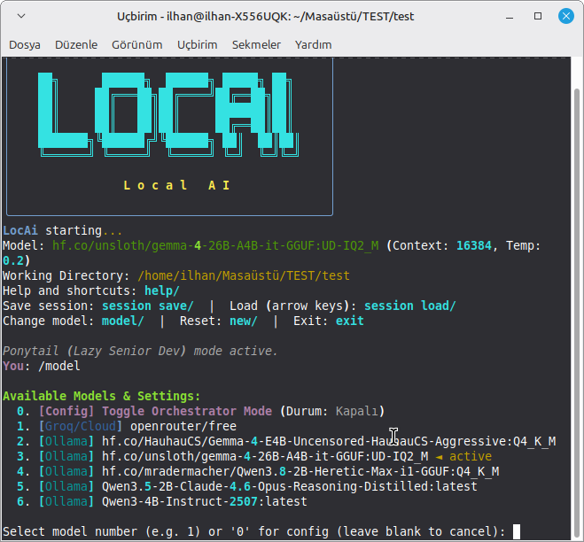
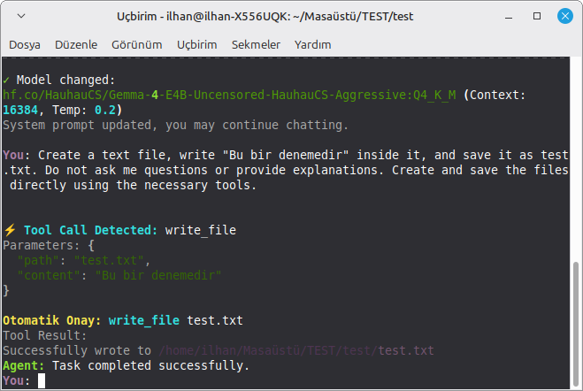

<div align="center">

# LocAi
**Small Models. Real Agents.**  
*Lightweight Local Coding Agent for Ollama and Other LLM Providers*





Turn small local LLMs into practical coding agents.
LocAi is a terminal-based agentic CLI that gives LLMs the ability to read files, modify code, execute commands, inspect projects, use tools and perform multi-step tasks.
Designed with a special focus on small and resource-efficient models such as Qwen3 0.6B / 1.7B / 4B.

[🇹🇷 Türkçe](#türkçe-kılavuz) • [🇬🇧 English](#english-guide)

</div>

---

<h2 id="english-guide">🇬🇧 English Guide</h2>

### 🎯 What is LocAi?
LocAi is more than a terminal chatbot.
It is an agent runtime that connects an LLM to your development environment and allows the model to interact with a real project through controlled tools.

Instead of:  
`User → LLM → Text Response`

LocAi enables:
```text
       ┌──────────────┐
       │     User     │
       └──────┬───────┘
              │
              ▼
       ┌─────────────────┐
       │      LocAi      │
       │   Agent Loop    │
       └────────┬────────┘
                │
                ▼
       ┌─────────────────┐
       │       LLM       │
       │  Qwen / Ollama  │
       └────────┬────────┘
                │ Tool Call
       ┌────────┴────────┐
       ▼        ▼        ▼
  Read Files  Edit Code  Run Shell
       │        │        │
       └────────┬────────┘
                ▼ Tool Result
                ▼
               LLM
                │ Next Step
                ▼
           Final Result
```
The model can therefore inspect → act → observe → correct → continue.

### ⭐ Why LocAi?
There are many LLM chat applications. LocAi focuses on a different problem:  
**How can we turn a small local model into a useful software agent?**

LocAi is designed around that idea.  
*Small Models. Real Agents.*

- 🧠 **Optimized for small LLMs**
- ⚡ **Designed for low-resource systems**
- 🔧 **Native-style tool calling**
- 📁 **Project file access**
- ✏️ **Code editing**
- 💻 **Shell / terminal execution**
- 🔒 **Workspace sandbox**
- 🔄 **Multi-step agent loop**
- 🧩 **Model-specific profiles**
- 🧠 **Qwen3 thinking control**
- 📦 **Compact tool descriptions**
- 💾 **Persistent sessions**
- 🤖 **Brain + Worker orchestration**
- 🌐 **Multiple LLM providers**

### 🚀 Features

#### 🧠 Small Model Optimization
LocAi was specifically optimized for smaller models that can struggle with traditional agent prompts.
Examples include: `qwen3:0.6b`, `qwen3:1.7b`, `qwen3:4b`, `qwen3:8b`, `qwen3:14b`, `qwen3:32b`.

Model profiles can automatically adapt important agent parameters depending on the model being used.
Qwen3 optimizations include:
- Thinking control
- `<think>...</think>` stream filtering
- `think=False` support where available
- Compact tool descriptions
- Repeat penalty tuning
- Tool-call parsing
- Empty-response recovery
- Context-window management
- Retry handling

The goal is simple: Get useful agent behavior from models that would normally be considered too small for serious agent workflows.

#### 🛠️ Tool System
LocAi gives the model access to controlled development tools. Current core tools include:

| Tool | Purpose |
|------|---------|
| `read_file` | Read project files |
| `write_file` | Create files |
| `edit_file` | Modify existing files |
| `list_dir` | Explore directories |
| `glob` | Find files by pattern |
| `grep` | Search project contents |
| `run_shell` | Execute terminal commands |
| `git_status` | Inspect Git status |
| `git_diff` | Inspect changes |

This allows the LLM to work with a real project instead of only generating code in chat.

#### 🔄 Agent Loop
LocAi uses a multi-step agent loop. A typical task looks like:
1. User gives a task ↓
2. LLM analyzes the request ↓
3. LLM requests a tool ↓
4. LocAi executes the tool ↓
5. Tool result is returned to the LLM ↓
6. LLM decides the next action ↓
7. More tools are executed ↓
8. Task is completed

For example:
**User:** "Find the authentication bug and fix it."  
**LocAi:** → inspect project → search authentication code → read relevant files → identify problem → edit code → run tests → inspect errors → fix remaining problems → report result

This is what makes LocAi an agent, rather than a simple chatbot.

#### 🤖 Orchestrator Mode
LocAi can optionally use a Brain + Worker architecture.
```text
       ┌─────────────────┐
       │   Brain Model   │
       │  Fast / Small   │
       └────────┬────────┘
                │ delegate_task
                ▼
       ┌─────────────────┐
       │  Worker Model   │
       │ Larger / Better │
       │   for coding    │
       └────────┬────────┘
                │
                ▼
          Project Files
```
The idea is to use:
- a smaller model for coordination
- a stronger model for difficult coding tasks

This can be useful when running different models for different parts of a workflow.

#### 🔒 Secure Workspace / Sandbox
Giving an LLM access to a terminal is powerful. It also requires safeguards. LocAi therefore restricts file and shell operations to the configured working directory.

The agent is designed around:
- Workspace-bound file operations
- Path normalization
- Path traversal protection
- Dangerous command detection
- Confirmation for destructive operations
- Configurable working directory

Examples of potentially dangerous commands can trigger additional confirmation instead of being executed blindly. The goal is to give the agent useful access to your project without giving it unrestricted access to your entire system.

#### 🐴 Ponytail Mode
LocAi includes an optional Ponytail mode. The idea is simple: **Do the smallest practical change that solves the problem.**

Instead of encouraging unnecessary refactoring or large rewrites, the mode encourages the agent to:
- avoid over-engineering
- reuse existing code
- minimize unnecessary changes
- prefer simple solutions
- focus on the requested task

Enable it with: `/ponytail on`  
Disable it with: `/ponytail off`
> 💖 **Special Thanks:** The Ponytail concept is a fantastic approach to minimal coding. If you love this mode as much as we do, please consider visiting and starring the original [Ponytail Repository](https://github.com/your-ponytail-repo-link) to show your support to its creator!

#### 💾 Sessions
LocAi supports persistent sessions. You can save a project conversation and continue later without starting from zero.
`/session save`, `/session list`, `/session load`

You can also switch models while preserving the conversation history. This makes it possible to start with a lightweight model and continue with another model when a task becomes more complex.

#### 🌐 Multiple LLM Providers
LocAi is primarily designed around local models, but it can also work with external providers. Supported integrations include:
- Ollama
- OpenRouter
- Groq
- NineRouter

This means the same agent workflow can be used with different model backends.

### ⚡ Quick Start

**1. Install pipx**  
If pipx is not installed:
```bash
pip install pipx
python -m pipx ensurepath
```
Restart your terminal after installation.

**2. Install LocAi**
```bash
pipx install https://github.com/ilhanakd-max/Local_Ajan/archive/refs/heads/main.zip
```
Or install with pip:
```bash
pip install https://github.com/ilhanakd-max/Local_Ajan/archive/refs/heads/main.zip
```

**🦙 Using Ollama**  
Install and start Ollama, then download a model. For example:
```bash
ollama pull qwen3:1.7b
```
Start LocAi:
```bash
locai --model qwen3:1.7b --workdir ~/my_project
```
Windows example:
```bash
locai --model qwen3:1.7b --workdir D:\Projects\MyProject
```

### 💻 Usage

**Interactive Mode**
```bash
locai --model qwen3:1.7b --workdir ~/projects/myapp
```
Then give the agent a task:
> "Analyze this project and find possible bugs."
> "Create a responsive login page for this project."
> "Run the tests, identify failures and fix them."

**One-Shot Mode**  
You can also run a single autonomous task:
```bash
locai run "list all TODO comments in the src directory" --model qwen3:1.7b
locai run "inspect the project and fix the failing tests" --model qwen3:4b
```

### 🧪 Example Agent Tasks
LocAi can be used for tasks such as:
- **Code analysis:** Analyze this project and explain the architecture.
- **Bug fixing:** Find the cause of the failing tests and fix it.
- **Refactoring:** Refactor this module without changing its public API.
- **Web development:** Create a responsive landing page for this application.
- **Project exploration:** Find all unused functions and report them.
- **Testing:** Run the test suite and fix the first failing test.
- **Git inspection:** Review the current git diff and explain the changes.

### 🖥️ CLI Commands
Inside an interactive session:

| Command | Description |
|---------|-------------|
| `help/` | Show available commands |
| `session save/` | Save current session |
| `session load/` | Load a saved session |
| `session list/` | List saved sessions |
| `model/` | Change model |
| `language/` | Change language |
| `new/` | Start a new session |
| `ponytail/` | Toggle Ponytail mode |
| `exit` | Exit LocAi |

Most commands also support the `/command` form. Examples: `/help`, `/model`, `/session save`, `/ponytail on`.

### 🧩 Tool Calling
LocAi is designed to tolerate different tool-call formats produced by different models.
The parser can recognize formats such as:
```xml
<tool_call>
{"name":"read_file","arguments":{"path":"main.py"}}
</tool_call>
```
as well as compatible alternative formats. This is particularly useful with smaller models whose tool-call formatting may not always be perfectly consistent.

### 🧠 Context Management
Long conversations can quickly exceed the context window of small models. LocAi therefore uses a character-budget based sliding-window strategy.

The system prioritizes:
`System Prompt + Recent Conversation + Latest Tool Results`  
instead of continuously allowing old messages to consume the entire context. This is especially important when running models with limited context windows.

### 📊 Why Small Models?
LocAi does not attempt to magically turn a 1.7B model into a 70B model. Instead, it changes how the model is used.

A small model can be much more useful when it has:
`Good tool descriptions + Structured agent loop + Compact context + Error recovery + Project tools + Sandboxing`

The project therefore explores a simple question:  
**How capable can a small local model become when it is given the right agent infrastructure?**

### 🏗️ Architecture
A simplified project structure:
```text
Local_Ajan/
│
├── src/
│   └── lokal_ajan/
│       │
│       ├── agent/
│       │   ├── loop.py
│       │   ├── context.py
│       │   └── thinking.py
│       │
│       ├── tools/
│       │
│       ├── clients/
│       │   ├── ollama_client.py
│       │   ├── openrouter_client.py
│       │   ├── groq_client.py
│       │   └── ninerouter_client.py
│       │
│       ├── safety/
│       │
│       └── config.py
│
├── tests/
├── assets/
├── pyproject.toml
└── README.md
```
The main agent loop coordinates:  
`LLM ↓ Tool Parser ↓ Tool Registry ↓ Tool Execution ↓ Observation ↓ Context Manager ↓ LLM`

### ⚙️ Configuration
LocAi reads configuration from: `~/.config/lokal-ajan/config.toml`

Typical configuration options include:
```toml
default_model = "qwen3:1.7b"
ollama_host = "http://127.0.0.1:11434"
max_steps = 20
```
The configuration system is designed to keep model and agent settings separate from the project itself.

### 🧪 Development
Clone the repository:
```bash
git clone https://github.com/ilhanakd-max/Local_Ajan.git
cd Local_Ajan
```
Install in editable mode:
```bash
pip install -e .
```
Run tests:
```bash
pytest
```
The project is written for: Python 3.11+

### 🗺️ Roadmap
LocAi is an evolving project. Potential future areas include:
- Improved planning and task decomposition
- Better tool-call recovery
- More robust coding workflows
- Improved project indexing
- Better test/fix/retest loops
- Additional model providers
- More agent tools
- Improved terminal UX
- Richer session management
- Better GUI/launcher experience
- More advanced multi-agent workflows

### 🎯 Project Philosophy
LocAi is built around a simple philosophy: **Local AI should be useful, not just private.**

A local model should be able to do more than answer questions. It should be able to:
`Understand a project ↓ Inspect files ↓ Make changes ↓ Run commands ↓ Observe results ↓ Correct mistakes ↓ Complete the task`

And it should be possible to do that without requiring a massive model or a cloud service.

### 🔐 Privacy
When using local Ollama models, your prompts and project data can remain on your own machine. Cloud providers are supported as optional backends, but local execution remains a core use case of LocAi.

### 🤝 Contributing
Contributions, bug reports, ideas and experiments are welcome. If you discover a model that works particularly well with LocAi, improvements to tool calling, context handling, safety or agent workflows are especially useful.

### 📜 License
See `LICENSE` for license information.

---

<div align="center">
  <b>LocAi</b><br>
  Small Models. Real Agents.<br>
  <i>Built for developers who want practical AI agents running directly in their terminal.</i>
</div>

---

<h2 id="türkçe-kılavuz">🇹🇷 Türkçe Kılavuz</h2>

### 🎯 LocAi nedir?
LocAi, lokal LLM modellerini gerçek bir yazılım ajanına dönüştürmek amacıyla geliştirilmiş terminal tabanlı bir agentic CLI uygulamasıdır.

Basit bir chatbot gibi yalnızca cevap üretmek yerine modelin:
- 📁 dosyaları okumasına
- ✏️ dosya oluşturup düzenlemesine
- 🔎 proje içerisinde arama yapmasına
- 💻 terminal komutları çalıştırmasına
- 🌿 Git durumunu incelemesine
- 🔄 çok adımlı görevler gerçekleştirmesine
olanak sağlar.

Özellikle küçük ve kaynak dostu modellerle çalışmaya odaklanır. Örneğin `qwen3:0.6b`, `qwen3:1.7b`, `qwen3:4b` gibi modellerle agent kullanımını daha uygulanabilir hale getirmeyi amaçlar.

### ⭐ Neden LocAi?
LocAi'nin temel fikri:  
**Küçük Model + İyi Agent Altyapısı = Gerçek İş Yapabilen Lokal Ajan**

Modelin yalnızca daha büyük olmasına güvenmek yerine:
`Tool Calling + Agent Loop + Compact Context + Error Recovery + Sandbox + Model Profiles`
gibi mekanizmalarla modelin mevcut kapasitesinden daha verimli yararlanmayı hedefler.

### 🧠 Qwen3 Optimizasyonları
LocAi, özellikle küçük Qwen3 modelleri için çeşitli optimizasyonlar içerir. Bunlar arasında:
- `think=False`
- `<think>` filtreleme
- kompakt tool tanımları
- model profilleri
- repeat penalty
- tool-call parser
- boş cevap kurtarma
- context sliding window
- retry mekanizmaları

### 🛠 Araçlar
LocAi'nin temel araçları:  
`read_file`, `write_file`, `edit_file`, `list_dir`, `glob`, `grep`, `run_shell`, `git_status`, `git_diff`  
Bu araçlar sayesinde ajan gerçek proje dosyaları üzerinde çalışabilir.

### 🔒 Güvenlik
LLM'ye terminal erişimi vermek güçlü bir özellik olduğu kadar dikkat gerektirir. LocAi bu nedenle çalışma alanını `workdir` ile sınırlandırır.

Temel güvenlik mekanizmaları:
- çalışma klasörü sınırı
- path traversal koruması
- tehlikeli komut algılama
- yıkıcı işlemler için onay
- sandbox yaklaşımı

### 🤖 Orkestratör / İşçi
LocAi iki farklı modeli birlikte kullanabilir.
```text
     BEYİN (Küçük / Hızlı model)
           │
           ▼ (Görevi planlar)
           │
           ▼
     İŞÇİ (Daha güçlü model)
           │
           ▼ (Kodlama / Görev)
```
Bu yapı özellikle küçük hızlı modeller ile daha güçlü modelleri aynı workflow içinde kullanmak için tasarlanmıştır.

### 🐴 Ponytail
Ponytail modu, ajanı daha minimal değişiklikler yapmaya yönlendiren bir çalışma modudur.
**Amaç:** Gereksiz refactoring yapma, mevcut kodu mümkün olduğunca kullan ve yalnızca gerekli değişiklikleri gerçekleştir.

Aktifleştirmek: `/ponytail on`  
Kapatmak: `/ponytail off`
> 💖 **Özel Teşekkür:** Ponytail (Lazy Senior Dev) konsepti, minimal kodlama felsefesinin harika bir örneğidir. Bu modu bizim kadar sevdiyseniz, lütfen orijinal geliştiricisine destek olmak için [Ponytail Reposuna](https://github.com/your-ponytail-repo-link) giderek yıldız (star) vermeyi unutmayın!

### 💾 Oturumlar
Oturumlar kaydedilebilir: `/session save`, `/session list`, `/session load`  
Böylece uzun bir projeye daha sonra devam edilebilir. Model değiştirildiğinde de mevcut konuşma geçmişinin korunması desteklenir.

### ⚡ Kurulum

**pipx:**
```bash
pip install pipx
python -m pipx ensurepath
```
Terminali yeniden başlattıktan sonra:
```bash
pipx install https://github.com/ilhanakd-max/Local_Ajan/archive/refs/heads/main.zip
```
**Alternatif:**
```bash
pip install https://github.com/ilhanakd-max/Local_Ajan/archive/refs/heads/main.zip
```

**🦙 Ollama ile kullanım:**
```bash
ollama pull qwen3:1.7b
locai --model qwen3:1.7b --workdir ~/projelerim/proje1
```
Windows:
```bash
locai --model qwen3:1.7b --workdir D:\Projeler\Proje1
```

### 🧪 Örnek Görevler
- "Bu projeyi analiz et ve mimarisini açıkla."
- "Testleri çalıştır ve hataları düzelt."
- "src klasöründeki TODO yorumlarını bul."
- "Bu web sayfasını responsive hale getir."
- "Git diff'i incele ve yapılan değişiklikleri açıkla."
- "Projede kullanılmayan fonksiyonları bul."

### 📌 Kısaca
LocAi bir chatbot değil; LLM'yi gerçek bir proje üzerinde çalışabilen bir ajana dönüştürmeye çalışan hafif bir agent runtime'dır.

**Small Models. Real Agents.**  
Yerel yapay zekayı gerçek bir yazılım ajanına dönüştür.
