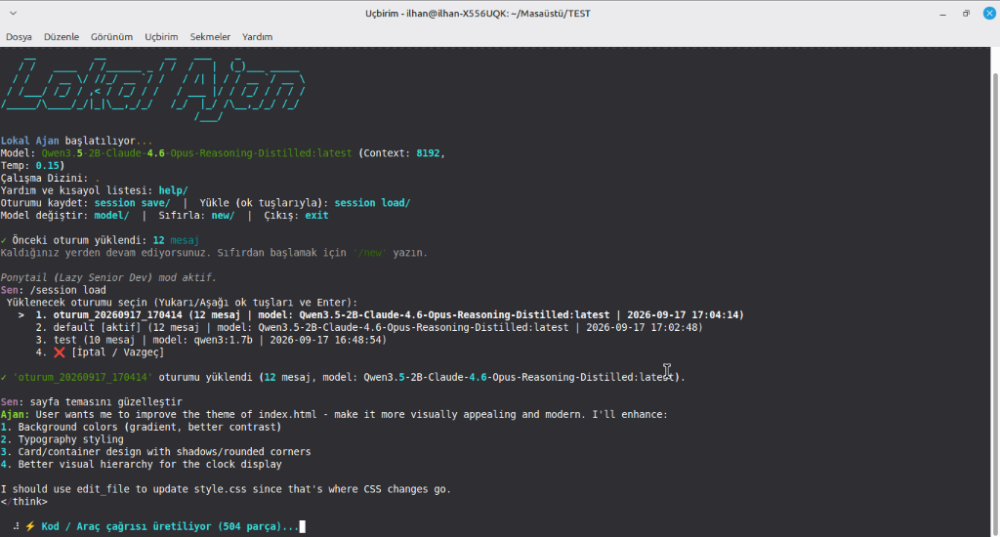

<div align="center">

# Lokal Ajan / Local Agent
**Terminal Tabanlı Agentic LLM Asistanı | Terminal-based Agentic LLM Assistant**



[Türkçe](#türkçe-kılavuz) | [English](#english-guide)

</div>

---

<h2 id="türkçe-kılavuz">🇹🇷 Türkçe Kılavuz</h2>

Lokal Ajan, Ollama tabanlı lokal yapay zeka modelleriyle ve bulut sağlayıcılarla (Groq, OpenRouter vb.) çalışan, terminal tabanlı ve **tool-calling (araç kullanma)** yeteneğine sahip bir CLI (Komut Satırı) aracıdır. Özellikle `qwen3:0.6b`, `qwen3:1.7b` gibi çok hafif modellerle bile güvenilir kod yazma ve sistem yönetimi görevlerini yerine getirmesi için optimize edilmiştir.

### 🚀 Özellikler ve Yetenekler

- **Çoklu Model Desteği:** Lokal Ollama modellerinin yanı sıra dış kaynaklı (Groq, OpenRouter, NineRouter) API'leri destekler.
- **Orkestratör Modu (Beyin + İşçi):** Görev planlaması için küçük/hızlı bir "Beyin" modeli, asıl kodlama işleri için daha büyük bir "İşçi" modeli atayarak performansı artırır.
- **Hızlı GPU Modu:** Küçük modelleri %100 GPU kapasitesine taşıyarak ve bağlam boyutunu 8K ile sınırlandırarak inanılmaz bir hız sağlar.
- **Ponytail (Lazy Senior Dev) Modu:** Ajanı, sadece en gerekli ve en pratik değişiklikleri yapmaya zorlayan; gereksiz kodlamadan kaçınan "tembel ama tecrübeli yazılımcı" modudur.
- **Güvenli Kum Havuzu (Sandbox):** Çalıştırdığı komutlar ve dosya değişiklikleri sadece sizin belirlediğiniz çalışma klasörüyle (workdir) sınırlandırılır. Dışarıya çıkamaz.
- **Tam Otonom Tool Calling:** Dosya okuma/yazma, terminal komutu çalıştırma ve web araması yapma yeteneklerine sahiptir.

### ⚡ Kurulum (Tek Satırla, Antivirüs Dostu)

Lokal Ajan'ı sisteminize küresel bir komut satırı aracı (tıpkı `npm install -g` gibi) olarak kurmak için **pipx** kullanılması önerilir. Bu yöntem hem Windows hem de Linux'ta tamamen güvenlidir ve antivirüs uyarılarını engeller.

**Adım 1: Pipx'i Kurun (Eğer yüklü değilse)**
```bash
pip install pipx
python -m pipx ensurepath
# UYARI: Bu işlemden sonra terminalinizi kapatıp YENİDEN AÇIN.
```

**Adım 2: Ajanı Kurun**
```bash
pipx install https://github.com/ilhanakd-max/Local_Ajan/archive/refs/heads/main.zip
```

*(Eğer `pipx` kullanmak istemiyorsanız, doğrudan `pip install https://github.com/ilhanakd-max/Local_Ajan/archive/refs/heads/main.zip` yazarak da standart kurulum yapabilirsiniz).*

Kurulum bittikten sonra terminalinizden herhangi bir klasörde sadece `localajan` yazarak uygulamayı başlatabilirsiniz.

### 🛠 Kullanım

Etkileşimli (Sohbet) Modu Başlatmak İçin:
```bash
localajan --model qwen3:1.7b --workdir ~/projelerim/foo
```

Tek Seferlik Görev Vermek İçin (Çalışıp Kapanır):
```bash
localajan run "src/ klasöründeki TODO yorumlarını listele" --model qwen3:1.7b
```

Terminal içi komutlar:
- `/model`: Kullanılan yapay zeka modelini menüden değiştirir.
- `/new`: Sohbet geçmişini temizler ve oturumu sıfırlar.
- `/ponytail on|off`: Lazy Senior Dev modunu açıp kapatır.
- `exit`: Çıkış yapar.

---

<h2 id="english-guide">🇬🇧 English Guide</h2>

Local Agent (Lokal Ajan) is a terminal-based agentic CLI tool with powerful **tool-calling** capabilities, built on top of Ollama (for local models) and external providers (Groq, OpenRouter, etc.). It is heavily optimized to produce reliable tool calls even with extremely small models like `qwen3:0.6b` or `qwen3:1.7b`.

### 🚀 Features & Capabilities

- **Multi-Model Support:** Seamlessly switch between local Ollama models and cloud APIs (Groq, OpenRouter, NineRouter).
- **Orchestrator Mode (Brain + Worker):** Use a fast, tiny "Brain" model for planning and reasoning, which delegates heavy coding tasks to a larger "Worker" model.
- **Fast GPU Mode:** Unlocks 100% GPU acceleration for tiny models by forcing an 8K context limit, drastically increasing token generation speed.
- **Ponytail (Lazy Senior Dev) Mode:** Forces the AI to adopt a "lazy but experienced developer" persona—writing minimal code, avoiding over-engineering, and utilizing existing standard libraries instead of creating boilerplate.
- **Secure Sandbox Engine:** The agent is strictly isolated. All file modifications and shell executions are sandboxed to the specified working directory (`workdir`) preventing unintended system modifications.
- **Autonomous Tool Use:** The agent can autonomously read/write files, execute bash/powershell commands, and search for context.

### ⚡ Quick Installation (Antivirus Safe)

To install Local Agent globally as a standalone CLI tool (similar to `npm install -g`), we recommend using **pipx**. This method is completely safe on both Windows and Linux, entirely avoiding antivirus flags.

**Step 1: Install Pipx (If not already installed)**
```bash
pip install pipx
python -m pipx ensurepath
# WARNING: Close and RESTART your terminal after running this command.
```

**Step 2: Install Local Agent**
```bash
pipx install https://github.com/ilhanakd-max/Local_Ajan/archive/refs/heads/main.zip
```

*(If you don't want to use `pipx`, you can also use standard pip: `pip install https://github.com/ilhanakd-max/Local_Ajan/archive/refs/heads/main.zip`)*

After installation, you can launch the app from anywhere by typing `localajan` in your terminal.

### 🛠 Usage

Start Interactive Session:
```bash
localajan --model qwen3:1.7b --workdir ~/my_projects/foo
```

Run a Single Autonomous Task (One-shot):
```bash
localajan run "list all TODO comments in the src/ directory" --model qwen3:1.7b
```

In-Chat Commands:
- `/model`: Opens an interactive menu to switch the active model on the fly.
- `/new`: Clears the conversation history and resets the session.
- `/ponytail on|off`: Toggles the Lazy Senior Dev coding mode.
- `exit`: Quits the application.

---
*Built for developers who want private, local, and lightning-fast AI agents right in their terminal.*
